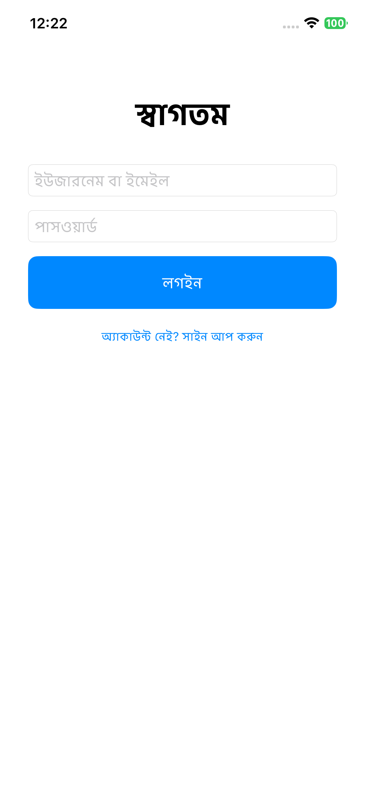
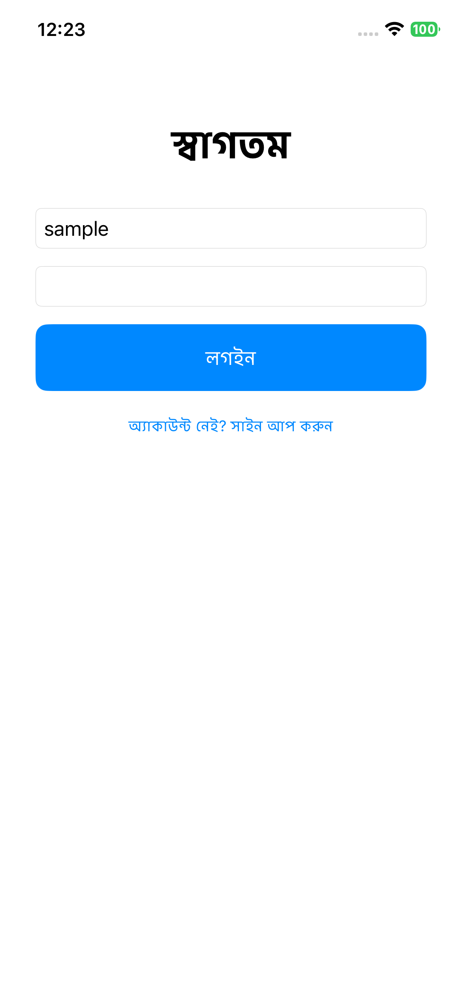
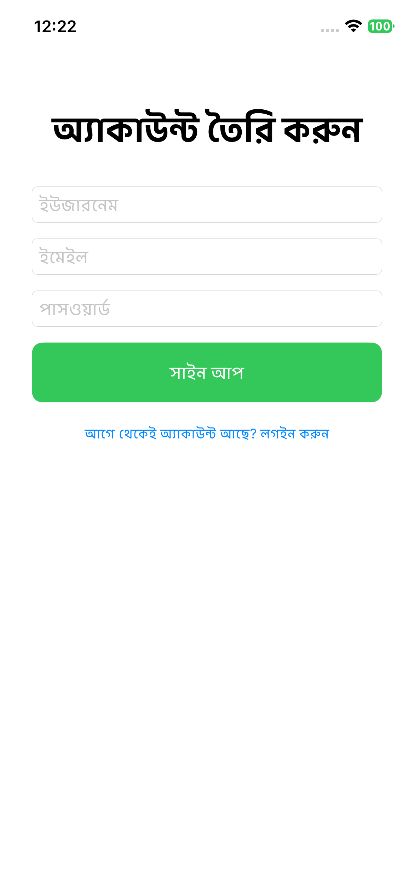
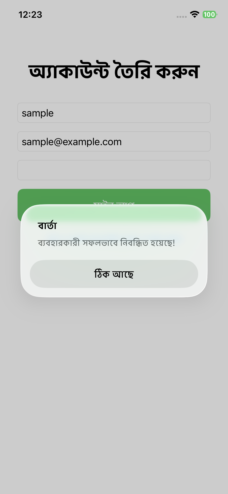
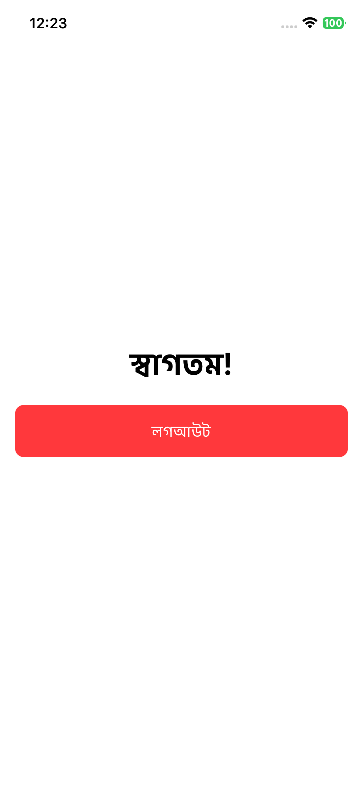

# SwiftUI Authentication System

A **full-stack authentication system** with a **SwiftUI** frontend and **Spring Boot + MySQL** backend. Supports login, registration, logout, token-based authentication, alerts, and **localization (English + Bangla)**.

---

## Description

This project demonstrates a clean, structured approach to building a robust, localized authentication system in SwiftUI. It follows best practices for networking and state management without requiring a separate, dedicated Swift `User` model, relying on token-based authentication managed by the `UserSession` ViewModel.

### Key Features

* **Login and registration** flows.
* **Alerts** with custom, localized messages.
* **Localization** support (English and Bangla).
* **Reusable components** (`AppButton`, `AppTextField`).
* **Token-based authentication** and secure storage.
* **Conditional navigation** after successful authentication.

The backend implementation is based on [SDEParag/Java-backend-Spring-boot-MySQL-login-logout-Authentication-System](https://github.com/SDEParag/Java-backend-Spring-boot-MySQL-login-logout-Authentication-System).

---

## Technologies Used

### Frontend (iOS App)

* **SwiftUI**
* **Combine** for reactive programming and networking.
* `Localizable.strings` for localization.

### Backend (Server)

* **Java**
* **Spring Boot**
* **MySQL** Database

---

## Screenshots 📸

The application is fully localized, demonstrated here in **Bangla**. Screenshots are located in the `screenshots/` directory.

| Login View | Login with Sample Data | Registration View | Registration Success | Home/Logout View |
| :---: | :---: | :---: | :---: | :---: |
|  |  |  |  |  |
| *(Empty Fields)* | *(Data Entered)* | *(Empty Fields)* | *(Alert Display)* | *(Logged In)* |

---

## Setup Instructions

### 1. Backend Setup (Spring Boot + MySQL)

1.  **Clone the backend repository:**
    ```bash
    git clone [https://github.com/SDEParag/Java-backend-Spring-boot-MySQL-login-logout-Authentication-System.git](https://github.com/SDEParag/Java-backend-Spring-boot-MySQL-login-logout-Authentication-System.git)
    ```
2.  Open the project in your preferred IDE (e.g., IntelliJ IDEA).
3.  **Configure MySQL:**
    * Update database connection details in `application.properties`.
    * In MySQL Workbench, run the following commands to verify the setup:
        ```sql
        SHOW DATABASES;
        USE authdb; -- Assuming your database is named authdb
        SHOW TABLES;
        SELECT * FROM users;
        ```
4.  **Run the Spring Boot backend.** Ensure the API is running and accessible at:
    * **Simulator:** `http://127.0.0.1:8080`
    * **Real device:** `http://<local-network-ip>:8080`

### 2. Frontend Setup (SwiftUI)

1.  Open the SwiftUI project in **Xcode**.
2.  **Environment Object:** Ensure `UserSession` is correctly provided in your main application file (`@main struct MyApp`):

    ```swift
    @main
    struct MyApp: App {
        @StateObject var session = UserSession()

        var body: some Scene {
            WindowGroup {
                LoginView()
                    .environmentObject(session)
            }
        }
    }
    ```

3.  **Base URL Configuration:** Update `API.getBaseURL` within the project to match your backend environment:
    * Use `http://127.0.0.1:8080` for the iOS **Simulator**.
    * Use your Mac’s **local network IP** (e.g., `http://192.168.1.100:8080`) for a **real device**.

4.  Run the app on a simulator or real device.

---

## API Endpoints

The SwiftUI frontend communicates with the following backend endpoints:

| Action | Method | Endpoint |
| :--- | :--- | :--- |
| **Login** | `POST` | `/api/auth/login` |
| **Registration** | `POST` | `/api/auth/register` |
| **Logout** | `POST` | `/api/auth/logout` |
| **Get User Info** | `GET` | `/api/user/me` |

---

## Localization 🌍

The application uses `Localizable.strings` for multilingual support (English and Bangla).

### Example Keys

| Key | English Value |
| :--- | :--- |
| `"LOGIN_TITLE"` | `"Welcome Back"` |
| `"USERNAME_OR_EMAIL_PLACEHOLDER"` | `"Username or Email"` |
| `"LOGIN_BUTTON_TITLE"` | `"Login"` |
| `"REGISTRATION_FROM_HERE_TITLE"` | `"Don't have an account? Sign Up"` |
| `"REGISTRATION_SUCCESSFULL_ALERT"` | `"User registered successfully!"` |

To add a new language, create a new `Localizable.strings` file (e.g., `Localizable.strings (French)`) and provide translations for all existing keys.

---

## Reusable Components

* **`AppButton`**: A custom button component with a customizable title, background color, and action for uniform styling.
* **`AppTextField`**: A custom text field for consistent input styling across the login and registration screens.

---

## License 📄

This project is licensed under the **MIT License**.